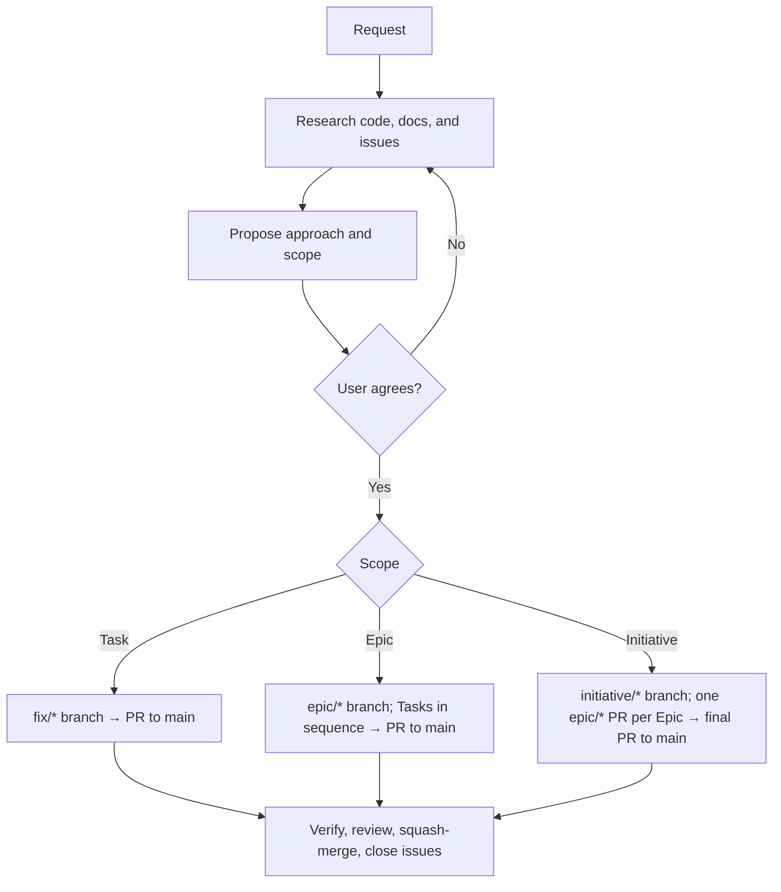

# Orchi

### One workflow. Three coding assistants.

**Research first. Agree the scope. Deliver through branches and GitHub Issues.**

Orchi is a development convention packaged as one agent skill. Git stores code and documentation; GitHub Issues store ownership, hierarchy, dependencies, and status. There is no controller, state database, approval receipt, or mandatory command facade. Install it for **Codex**, **GitHub Copilot**, **Claude Code**, or any combination of the three.

[Quick start](#quick-start) · [How it works](#how-it-works) · [Project instructions](#project-instructions) · [Documentation](#documentation)

---

## Quick start

### 1. Install from your project

Run this in the repository where you want to use Orchi:

```bash
npx --yes github:nkhus/orchi --agents all
```

The current directory is the installation target; use `--project /path/to/project` to choose another one.

| Your setup | Installation option |
| --- | --- |
| Codex | `--agents codex` |
| GitHub Copilot | `--agents copilot` |
| Claude Code | `--agents claude` |
| Copilot and Claude Code | `--agents copilot claude` |
| All three | `--agents all` |
| Choose interactively | Omit `--agents` in a terminal |

Adding another assistant later reuses the shared skill and preserves existing selections.

**Prerequisites:** Git, the GitHub CLI (`gh`, authenticated) for Issue and PR work, and Python 3.11+ for the bundled standard-library scripts. The `npx` installer also needs Node.js 18+ and `uv`. Use macOS, Linux, or WSL.

<details>
<summary><strong>Install across projects, preview changes, or remove Orchi</strong></summary>

```bash
npx --yes github:nkhus/orchi --global --agents copilot claude
```

| Option | Effect |
| --- | --- |
| `--dry-run` | Show planned file changes without writing |
| `--replace-orchi` | Back up and replace locally edited Orchi skill files |
| `--uninstall` | Remove the complete managed Orchi installation at the selected scope |

See the [installation guide](docs/installation.md) for paths, conflict handling, upgrading from the five-skill layout, offline installation, and removal.

</details>

### 2. Start a request

Open a fresh assistant session and ask:

```text
Use Orchi to add CSV export to the orders page.
```

Or invoke it explicitly: `$orchi` in Codex CLI, `/orchi` in Copilot CLI and Claude Code, or the IDE's skill picker. The installed project instructions also route implementation requests to Orchi.

## How it works



- **Agree before tracking.** Research and a proposed scope come first. Branches, Issues, and changes follow the user's agreement, not an agent's guess.
- **Scale the ceremony to the work.** A small fix is one Task and one PR. An Epic is one branch and one PR with sequential Tasks. An Initiative integrates several Epic PRs on its own branch before one final PR to main.
- **GitHub is the shared state.** `Initiative`, `Epic`, and `Task` labels, native sub-issues and `blocked by` dependencies, assignees, and `in-progress` describe hierarchy and ownership. Several assistants can work on independent Epics in parallel, each in its own branch and worktree.
- **Documentation follows the code.** Core documentation changes land with the implementation in the Epic branch. Initiative plans live in `docs/initiatives/<slug>/README.md` and are never presented as current behavior.
- **Verify once, repair precisely.** Each Epic gets one full review; demonstrated blockers are repaired and rechecked with a targeted follow-up. Merging and deployment stay within the user's authority.

The [skill](skills/orchi/SKILL.md) is the complete workflow. Stage references cover [planning](skills/orchi/references/planning.md), [execution](skills/orchi/references/execution.md), [knowledge](skills/orchi/references/knowledge.md), [review and delivery](skills/orchi/references/review-delivery.md), [GitHub conventions](skills/orchi/references/github.md), and [documentation retrieval](skills/orchi/references/retrieval.md).

## Project instructions

| File or directory | Purpose |
| --- | --- |
| `.agents/skills/orchi/` | The canonical skill, shared by all assistants |
| Root `AGENTS.md` | Managed Orchi workflow instructions |
| `.github/copilot-instructions.md` | Copilot pointer to the shared root instructions, when selected |
| Root `CLAUDE.md` | Claude import of `AGENTS.md`, when selected |
| `.claude/skills/orchi` | Relative link to the shared skill, when Claude is selected |

The installer preserves your existing instruction text. It maintains only the section between `<!-- orchi:begin -->` and `<!-- orchi:end -->` and refuses to overwrite a locally edited managed section. Repository instructions take precedence over Orchi's defaults, so an existing issue template or check command keeps working.

Commit the installed files, link, instruction changes, and installation manifest to share the setup with your team.

## Documentation

| Guide | Read it to… |
| --- | --- |
| [Installation](docs/installation.md) | Select assistants; install, upgrade, or remove the skill |
| [Testing](docs/testing.md) | Validate the package and run the installed-skill smoke test |
| [External references](docs/references.md) | Find the skill standards and assistant documentation |

## Contributing

The installable skill lives in `skills/orchi/`. Repository-only validation, tests, and documentation live in `tools/`, `tests/`, and `docs/`.

```bash
python3 -m venv .venv
. .venv/bin/activate
python -m pip install -r requirements-dev.txt
python tools/validate_package.py
python -m pytest -q
```

See [contributing](CONTRIBUTING.md). Deterministic tests establish installer and tool behavior, not live model quality.
