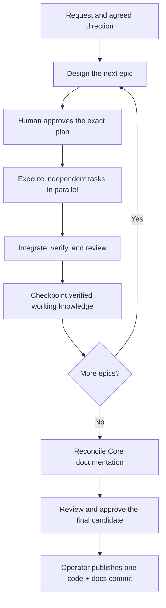

# Orchi

### One workflow. Three coding assistants.

**Plan deliberately. Execute in parallel. Publish one verified result.**

Orchi turns a coding request into an approved plan, bounded implementation tasks, and a reviewed code-and-documentation result. Install one shared skill set for **Codex**, **GitHub Copilot**, **Claude Code**, or any combination of the three.

[Quick start](#quick-start) · [How it works](#how-it-works) · [Project instructions](#project-instructions) · [Documentation](#documentation)

---

## Quick start

### 1. Install from your project

Run this in the repository where you want to use Orchi. No manual download or clone is needed:

```bash
npx --yes github:nkhus/orchi#feat/multi-agent-installation --agents all
```

This command uses the `feat/multi-agent-installation` branch. The current directory is the installation target; use `--project /path/to/project` to choose another one.

Choose the assistants you use:

| Your setup | Installation option |
| --- | --- |
| Codex | `--agents codex` |
| GitHub Copilot | `--agents copilot` |
| Claude Code | `--agents claude` |
| Copilot and Claude Code | `--agents copilot claude` |
| All three | `--agents all` |
| Choose interactively | Omit `--agents` in a terminal |

All five skills are installed together. Adding another assistant later reuses the shared bundle and preserves your existing selections.

**Prerequisites:** Node.js 18+, npm, Git, and `uv`. The Python runtime requires Python 3.11+; `uv` manages its environment separately from your application's dependencies. Use macOS, Linux, or WSL.

Automatic workers also need the selected assistant's installed and authenticated terminal program: `codex`, `copilot`, or `claude`. Orchi reports missing programs with installation links; it does not install those programs or sign you in.

<details>
<summary><strong>Install across projects, preview changes, or remove Orchi</strong></summary>

For a user-wide installation:

```bash
npx --yes github:nkhus/orchi#feat/multi-agent-installation --global --agents copilot claude
```

Useful options for the same installer:

| Option | Effect |
| --- | --- |
| `--dry-run` | Show planned file changes without writing |
| `--replace-orchi` | Back up and replace differing installed skill files |
| `--uninstall` | Remove the complete managed Orchi installation at the selected scope |

User-wide installation writes to your home directory. Project installation writes to the selected repository, including its root instructions. Stop active workers before updating or removing an installation.

See the [installation guide](docs/installation.md) for paths, conflict handling, offline installation, and removal behavior. Use the branch-qualified source above when installing this branch.

</details>

### 2. Check the installation and configure execution

For a project installation:

```bash
uv run .agents/skills/orchi/scripts/orchi.py doctor --repo .
```

Before the first initiative, follow the [operator setup guide](skills/orchi/references/operator-guide.md) to configure trusted project checks, external control state, a protected signing key, and worker access boundaries.

Installation makes the skills available. Operator setup establishes how tasks are authorized and verified. `doctor` checks local prerequisites; it does not verify authentication, model behavior, or isolation.

### 3. Start a request

Open a fresh assistant session and ask:

```text
Use Orchi to implement CSV export for the orders page.
Agree on the outcome and epic roadmap first, then design the next epic.
Execute approved independent tasks in parallel and verify the combined result.
Update Core documentation only when the entire request is complete.
```

You can also invoke the entrypoint explicitly:

| Assistant | Invocation |
| --- | --- |
| Codex CLI | `$orchi` |
| Copilot CLI | `/orchi` |
| Claude Code | `/orchi` |

In an IDE, use its skill selection interface or ask it to use Orchi. The installed project instructions also direct implementation requests to the entrypoint.

## How it works

One **initiative** represents the whole request. An **epic** is the next useful milestone. A **task** is a designed unit of work with exact scope, context, and verification requirements.



- **Plan from actual results.** Future epics stay at roadmap level until it is time to design them.
- **Give workers bounded assignments.** Each worker receives a task packet and an assigned Git worktree. Readiness passes before implementation starts.
- **Verify what gets integrated.** The controller checks each candidate and its combination with already accepted work. A worker's completion message is not proof of success.
- **Keep decisions recoverable.** Approvals, attempts, checks, and workflow state are recorded outside the conversation.
- **Publish at the request boundary.** The operator publishes the final approved code, documentation, and initiative archive together. Orchi does not automatically merge or deploy.

A small request can use one epic. Ordinary tasks within an approved epic do not require repeated plan approval; material changes return to the human.

## Project instructions

Orchi registers itself where each assistant looks for instructions:

| File or directory | Purpose |
| --- | --- |
| `.agents/skills/` | One canonical copy of the five skills and shared runtime |
| Root `AGENTS.md` | Managed Orchi workflow instructions |
| `.github/copilot-instructions.md` | Copilot pointer to the shared root instructions, when selected |
| Root `CLAUDE.md` | Claude import of `AGENTS.md`, when selected |
| `.claude/skills/` | Relative links to the shared skills, when Claude is selected |

The installer preserves your existing instruction text. It maintains only the section between `<!-- orchi:begin -->` and `<!-- orchi:end -->`, and refuses to overwrite a locally edited managed section. An existing `AGENTS.override.md` receives the workflow section too.

Commit the installed files, links, instruction changes, and installation manifest to share project setup with your team. User-wide installation uses each assistant's personal instruction location instead of editing project roots.

## Five skills, one entrypoint

| Skill | Responsibility |
| --- | --- |
| **`orchi`** | Start or continue; route using controller state |
| `orchi-plan` | Agree on the initiative and design the next epic |
| `orchi-work` | Execute approved task packets through bounded workers |
| `orchi-review` | Review exact candidates and triage actionable findings |
| `orchi-deliver` | Checkpoint knowledge, reconcile Core, and prepare publication |

The four stage skills share the `orchi` runtime and references. An assigned packet worker follows its task rather than starting another coordinator.

**Choose the coordinator and worker provider independently.** Codex, Copilot CLI, and Claude Code each have a bundled worker adapter. Multiple integrations can coexist, while each foreground run uses one explicitly selected adapter. A generic command adapter and manual packet handoff support other assistants.

## Documentation that follows the implementation

| Layer | What it contains |
| --- | --- |
| **Core** | Canonical `docs/` describing the system; unchanged during intermediate epics |
| **Verified Working Knowledge** | Initiative-scoped facts from completed, checked epics |
| **Proposals** | The active epic's design and intended changes |

Workers receive the last knowledge checkpoint, the approved task design, and accepted dependency results. At the end of the initiative, Orchi reconciles the cumulative result into Core and verifies the exact final code-and-docs tree.

## Documentation

| Guide | Read it to… |
| --- | --- |
| [Installation](docs/installation.md) | Select assistants; install, update, or remove the shared bundle |
| [Operator setup](skills/orchi/references/operator-guide.md) | Configure checks, workers, approvals, and publication |
| [Architecture](docs/architecture.md) | Understand the controller, state, and publication boundary |
| [Planning and task packets](docs/planning-and-packets.md) | Design epics, task contracts, context, and parallelism |
| [Knowledge lifecycle](docs/knowledge-lifecycle.md) | Understand Core, working knowledge, and reconciliation |
| [Protocol](docs/protocol.md) | Follow state transitions, approvals, review, and recovery |
| [Security](docs/security.md) | Establish trust boundaries and worker isolation |
| [Testing](docs/testing.md) | Run deterministic checks and separate live model evaluations |
| [External references](docs/references.md) | Find the underlying skill standards and assistant documentation |

## Contributing

The installable bundle lives in `skills/`. Shared Python code is in `skills/orchi/scripts/orchi_core/`; repository-only validation, tests, and documentation live in `tools/`, `tests/`, and `docs/`.

```bash
python3 -m venv .venv
. .venv/bin/activate
python -m pip install -r requirements-dev.txt
python tools/validate_package.py
python -m pytest -q
```

See [contributing](CONTRIBUTING.md) for contracts and source ownership, and [testing](docs/testing.md) for installation smoke tests and the disposable synthetic demo.

Deterministic tests establish mechanical behavior, not live model quality. Git worktrees separate checkouts but are not security sandboxes. Keep operator keys and control state outside worker access; see the [security guide](docs/security.md).
