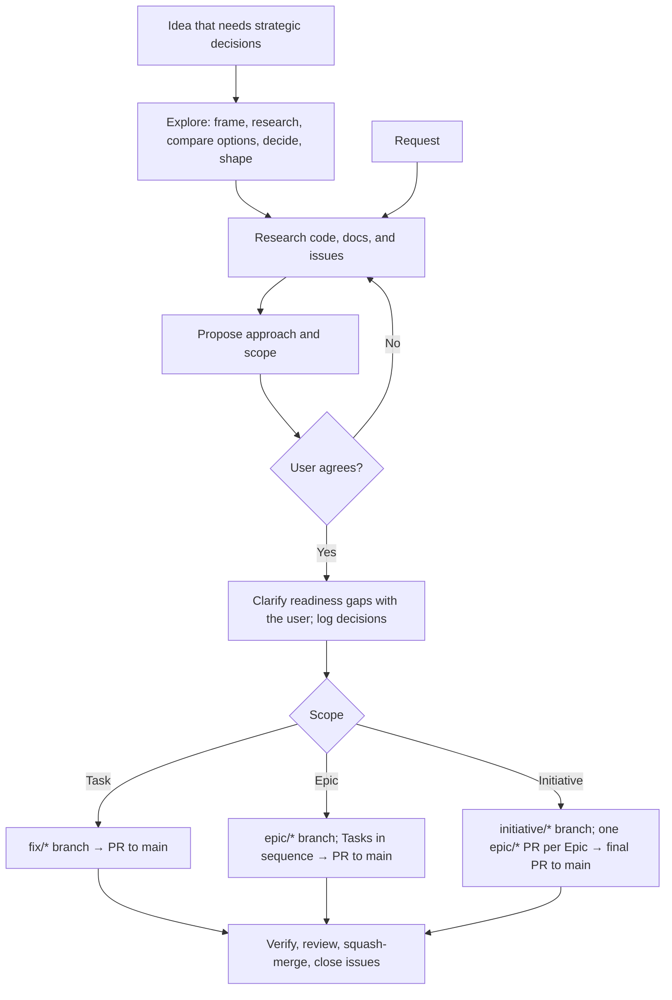

# Orchi

### One workflow for Claude Code.

**Research first. Agree the scope. Deliver through branches and GitHub Issues.**

Orchi is a development convention packaged as one agent skill, with three optional entry skills and six model-tiered subagents. Git stores code and documentation; GitHub Issues store ownership, hierarchy, dependencies, and status. There is no controller, state database, approval receipt, or mandatory command facade. It installs into **Claude Code**.

[Quick start](#quick-start) · [How it works](#how-it-works) · [Subagents and entry skills](#subagents-and-entry-skills) · [Project instructions](#project-instructions) · [Documentation](#documentation)

---

## Quick start

### 1. Install from your project

Run this in the repository where you want to use Orchi:

```bash
npx --yes github:nkhus/orchi
```

The current directory is the installation target; use `--project /path/to/project` to choose another one.

**Prerequisites:** Git, the GitHub CLI (`gh`, authenticated) for Issue and PR work, and Python 3.11+ for the bundled standard-library scripts. The `npx` installer also needs Node.js 18+ and `uv`. Use macOS, Linux, or WSL.

<details>
<summary><strong>Install across projects, preview changes, or remove Orchi</strong></summary>

```bash
npx --yes github:nkhus/orchi --global
```

| Option | Effect |
| --- | --- |
| `--github` | Also add issue templates, a PR template, a documentation check workflow, and Orchi labels (project scope) |
| `--no-docs-workflow` | With `--github`, skip the documentation check workflow; `--docs-workflow` restores it |
| `--dry-run` | Show planned file changes and conflicts without writing |
| `--replace-orchi` | Back up and replace locally edited Orchi files |
| `--version` | Show the installed and bundled versions and the upgrade command |
| `--uninstall` | Remove the complete managed Orchi installation at the selected scope |

To upgrade, rerun the same `npx` command; unmodified managed files update in place. See the [installation guide](docs/installation.md) for paths, conflict handling, upgrading from earlier versions, offline installation, and removal.

</details>

### 2. Start a request

Open a fresh Claude Code session and ask:

```text
Use Orchi to add CSV export to the orders page.
```

Or invoke it explicitly: `/orchi`, or the IDE's skill picker. The installed project instructions also route implementation requests to Orchi. You can also start with the [entry skills](#subagents-and-entry-skills): `/orchi-plan <request>`.

## How it works


```mermaid
flowchart TD
    X[Idea that needs strategic decisions] --> Y[Explore: frame, research, compare options, decide, shape]
    Y --> B
    A[Request] --> B[Research code, docs, and issues]
    B --> C[Propose approach and scope]
    C --> D{User agrees?}
    D -->|No| B
    D -->|Yes| Q[Clarify readiness gaps with the user; log decisions]
    Q --> E{Scope}
    E -->|Task| F[fix/* branch → PR to main]
    E -->|Epic| G[epic/* branch; Tasks in sequence → PR to main]
    E -->|Initiative| H[initiative/* branch; one epic/* PR per Epic → final PR to main]
    F --> I[Verify, review, squash-merge, close issues]
    G --> I
    H --> I
```

- **Explore before planning when the direction is open.** For a new project, module, or feature that needs strategic decisions, `orchi-explore` frames the idea with the user, sends `orchi-researcher` agents to primary sources and to design at least three different options, records each decision, and keeps the whole map in one `Exploration` Issue. Planning takes that Issue as agreed input for an Initiative, Epic, or Task.
- **Agree before tracking.** Research, a proposed scope, and then the proposed breakdown into Epics or Tasks come first. Branches, Issues, and changes follow the user's agreement, not an agent's guess.
- **Scale the ceremony to the work.** A small fix is one Task and one PR. An Epic is one branch and one PR with sequential Tasks. An Initiative integrates several Epic PRs on its own branch before one final PR to main.
- **Every title shows its lineage.** Initiatives and Epics have short tags, and titles start with them: Initiative `[PAY] Card payments`, Epic `[PAY][TOKEN] Tokenize stored cards`, Task `[PAY][TOKEN] Add token column`. Labels carry the type, and branches reuse the tags (`epic/pay-token-tokenize-cards`).
- **GitHub is the shared state.** `Initiative`, `Epic`, and `Task` labels, native sub-issues and `blocked by` dependencies, assignees, and `in-progress` describe hierarchy and ownership. Several Claude Code sessions can work on independent Epics in parallel, each in its own branch and worktree. `scripts/status.py` shows which Epics are ready, blocked, or claimed.
- **Documentation follows the code.** Core documentation changes land with the implementation in the Epic branch, and every PR states its documentation impact. With `--github`, CI fails on broken local links the PR introduces or an empty impact section. Initiative plans live in `docs/initiatives/<tag>-<slug>/README.md` and are never presented as current behavior.
- **Verify once, repair precisely.** Every new test is shown failing before the change. Each Epic gets one full review along three separate axes (Spec, including scope creep; Standards; Tests), with a design audit by `orchi-designer` when it changes user interface; demonstrated blockers are repaired and rechecked with a targeted follow-up. Each PR states its merge risk: a one-way or two-way door, and the blast radius. Interrupted work leaves a fixed Handoff section in the PR. Merging and deployment stay within the user's authority.

The [skill](skills/orchi/SKILL.md) is the complete workflow. Stage references cover [planning](skills/orchi/references/planning.md), [readiness](skills/orchi/references/readiness.md), [execution](skills/orchi/references/execution.md), [testing](skills/orchi/references/testing.md), [knowledge](skills/orchi/references/knowledge.md), [review and delivery](skills/orchi/references/review-delivery.md), [GitHub conventions](skills/orchi/references/github.md), and [documentation retrieval](skills/orchi/references/retrieval.md).

## Subagents and entry skills

The installer renders six Claude Code subagents from one definition each in [`skills/orchi/roles/`](skills/orchi/roles/README.md). The main session talks to the user, owns Issues, pushes, and merges; it may delegate retrieval, research and option design, one Task or defect repair at a time, UI design, and review.

| Agent | Model / effort | Writes | Role |
| --- | --- | --- | --- |
| `orchi-scout` | haiku / medium | nothing | Returns paths, line ranges, and excerpts |
| `orchi-researcher` | opus / medium | nothing | Answers an exploration question from cited primary sources, or designs one option under a given lens |
| `orchi-implementer` | opus / low | one commit per Task | Runs the Task readiness gate, then implements and verifies one Task, standalone or in an Epic |
| `orchi-fixer` | sonnet / medium | one commit per Task or repair | Makes one small, fully specified change — a simple Task or a confirmed defect repair — and escalates anything larger |
| `orchi-reviewer` | opus / high | nothing | Reviews a standalone Task, an assembled Epic, or a final Initiative candidate |
| `orchi-designer` | opus / medium | one commit per UI Task; nothing in Audit mode | Implements one ready UI Task or audits a UI diff with the installed design skills (Impeccable, Taste Skill, SmoothUI) |

Implementers, fixers, designers, and reviewers may start `orchi-scout` or `orchi-reviewer` for independent sub-questions, researchers start scouts or other researchers, and scouts only other scouts; only the main session starts the writers `orchi-implementer`, `orchi-fixer`, and `orchi-designer`, and nested agents never talk to the user, change Issues, push, or merge. Claude Code allows subagents to start their own, up to three layers below the main conversation, by default ([Claude Code subagents](https://code.claude.com/docs/en/sub-agents)). If a model or agent is unavailable, the main session does the step itself.

Three explicit entry skills fix the order of steps; they are conveniences, not a required facade:

- `orchi-explore` (`/orchi-explore <idea>` or `#<exploration>`) researches and shapes an idea with the user before any scope exists: frame, research, diverge into at least three options, converge on decisions, shape requirements and candidate Epics. It keeps everything in an `Exploration` Issue, resumes from it, creates no delivery branch or product code, and ends with `Plan with: /orchi-plan #<n>`.

- `orchi-plan` (`/orchi-plan <request>` or `#<exploration>`) researches, proposes a scope, and waits for agreement. It then clarifies before tracking: each gap the readiness checklist would otherwise force it to guess becomes a question with answerable options and a recommendation, asked in rounds and recorded in a decision log; questions the user has delegated, the main session decides itself and records. It shows the proposed Epics or Tasks and waits for agreement, then creates ready Issues and ends with `Deliver with: /orchi-deliver #<n>`.
- `orchi-deliver` (`/orchi-deliver #<n> [--merge-epics]`) delivers a standalone Task, Epic, or Initiative through the subagents and resumes interrupted delivery. It never merges into main; `--merge-epics` allows merging reviewed Epic PRs into their Initiative branch.

`orchi-plan` and `orchi-deliver` enforce the [readiness checklists](skills/orchi/references/readiness.md) for Tasks, Epics, and Initiatives: `orchi-plan` checks every Issue it creates, and `orchi-deliver` checks the Task, Epic, or Initiative again before delivering it.

## Project instructions

| File or directory | Purpose |
| --- | --- |
| `.claude/skills/orchi/` | The Orchi skill |
| `.claude/skills/orchi-explore/`, `.claude/skills/orchi-plan/`, `.claude/skills/orchi-deliver/` | Optional explicit entry skills |
| Root `CLAUDE.md` | Managed Orchi workflow instructions |
| `.claude/agents/orchi-*.md` | Rendered subagents |
| `.github/ISSUE_TEMPLATE/orchi-*.yml`, `.github/workflows/orchi-docs.yml` | Issue forms and documentation check, with `--github`; reinstalling replaces unmodified files; edited ones are conflicts that need `--replace-orchi` |
| PR template | Managed Summary, Verification, Merge risk, Documentation impact, and Handoff sections, with `--github` |
| `.claude/.orchi-install.json` | Installation manifest: the installed version, options, and the managed files (with hashes) and sections that reinstalling and uninstalling rely on |

The installer preserves your existing instruction text. It maintains only the section between `<!-- orchi:begin -->` and `<!-- orchi:end -->` and refuses to overwrite a locally edited managed section. Repository instructions take precedence over Orchi's defaults, so an existing issue template or check command keeps working.

Commit the installed skills, rendered agents, instruction changes, and installation manifest to share the setup with your team.

## Documentation

| Guide | Read it to… |
| --- | --- |
| [Installation](docs/installation.md) | Install, upgrade, or remove the skill |
| [Subagent roles](skills/orchi/roles/README.md) | Choose a writer, see each role's model and tools, and find the design skills `orchi-designer` uses |
| [Testing](docs/testing.md) | Validate the package and run the installed-skill smoke test |
| [External references](docs/references.md) | Find the skill standards and Claude Code documentation |

## Contributing

The installable skills live in `skills/`; subagent roles live in `skills/orchi/roles/`. Repository-only validation, tests, and documentation live in `tools/`, `tests/`, and `docs/`.

```bash
python3 -m venv .venv
. .venv/bin/activate
python -m pip install -r requirements-dev.txt
python tools/validate_package.py
python -m pytest -q
```

See [contributing](CONTRIBUTING.md). Deterministic tests establish installer and tool behavior, not live model quality.
